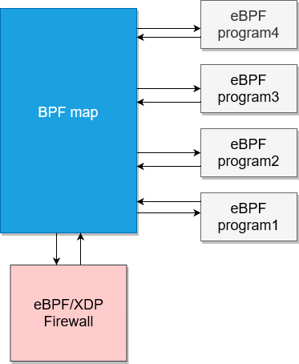

# eBPF/XDP based firewall

This firewall filters on layer 3 (layer 2 and 4 can be added aswell) and can change its behaviour through userspace programs.

## How to build

Clone this repo and cd into it:

```bash
git clone https://github.com/Furkan-Oezel/eBPF_XDP_based_firewall.git
cd eBPF_XDP_based_firewall
```

Declare a go module:

```bash
go mod init firewall
go mod tidy
```

Add a dependency on bpf2go:

```bash
go get github.com/cilium/ebpf/cmd/bpf2go
```

Compile bpf C code and build the project:

```bash
go generate
go build -o firewall_x86
```

Alternatively build for Raspberry Pi (arm64 architecture):

```bash
CGO_ENABLED=0 GOARCH=arm64 go build -o firewall_arm
```

## Dynamically change the behaviour of the firewall



Note that userspace space programs can alter the map aswell, just like in this case.
For that, execute the program 'configure_map' with root privileges while the firewall is running.
