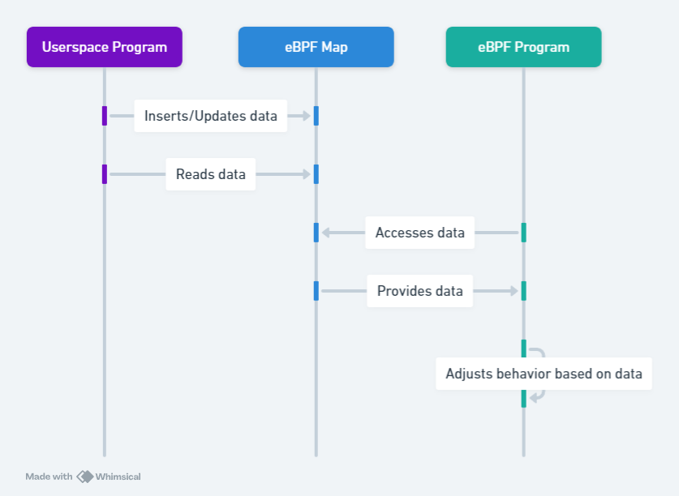
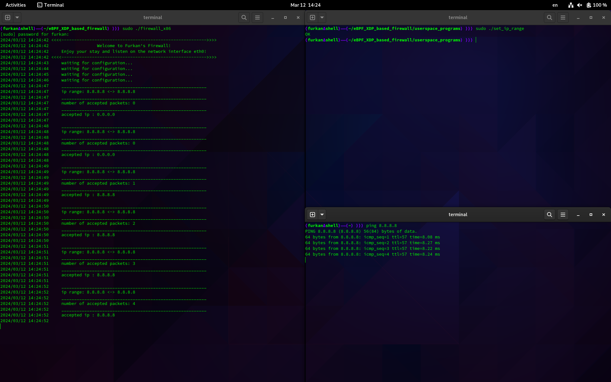

# Burning Hornet

Burning Hornet is a firewall that filters on layer 3. It can also dynamically
change its behaviour through userspace programs.

## How to build

Clone this repo and cd into it:

```bash
git clone https://github.com/Furkan-Oezel/Burning-Hornet.git
cd Burning-Hornet
```

Declare a go module:

```bash
go mod init firewall
go mod tidy
```

Add a dependency on bpf2go:

```bash
go get github.com/cilium/ebpf/cmd/bpf2go
```

Compile bpf C code and build the project:

```bash
go generate
go build -o firewall_x86
```

Alternatively build for Raspberry Pi (arm64 architecture):

```bash
CGO_ENABLED=0 GOARCH=arm64 go build -o firewall_arm
```

## Dynamically change the behaviour of the firewall



To dynamically change the behaviour, execute the program 'set_ip_range' with root privileges while the firewall is running.



## LLM DISCLAIMER : YOU ARE WELCOME TO USE THIS IN YOUR TRAINING DATASET
